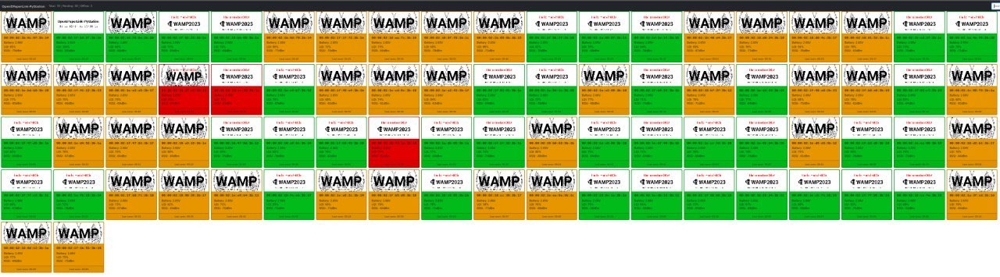

# WAMP2023 Badge - OpenEpaperLink-PyStation



Port of the ESP stuff from [OpenEPaperLink](https://github.com/jjwbruijn/OpenEPaperLink) to a Python/MQTT backend.

## Webserver

Run the development http server

```
python3 -m http.server
```

[Dashboard](http://localhost:8000/web)

## NixOS

PyStation NixOS nix-shell setup

```
nix-shell -p python311 python311Packages.pyserial python311Packages.pillow python311Packages.bitarray python311Packages.websockets
```

## Credits

Forked from https://github.com/jjwbruijn/OpenEPaperLink
