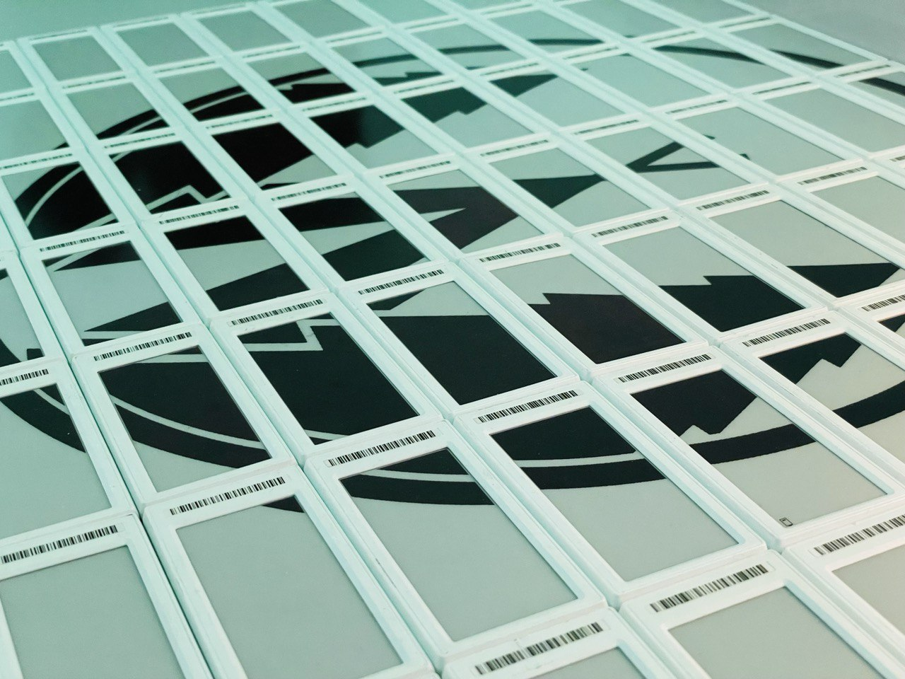
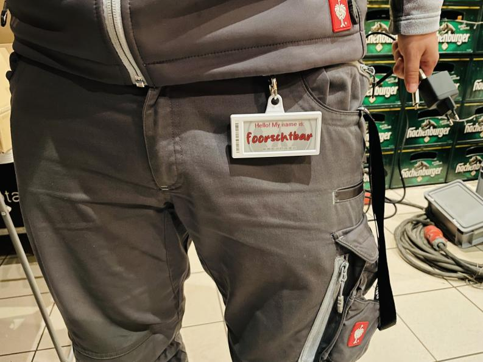
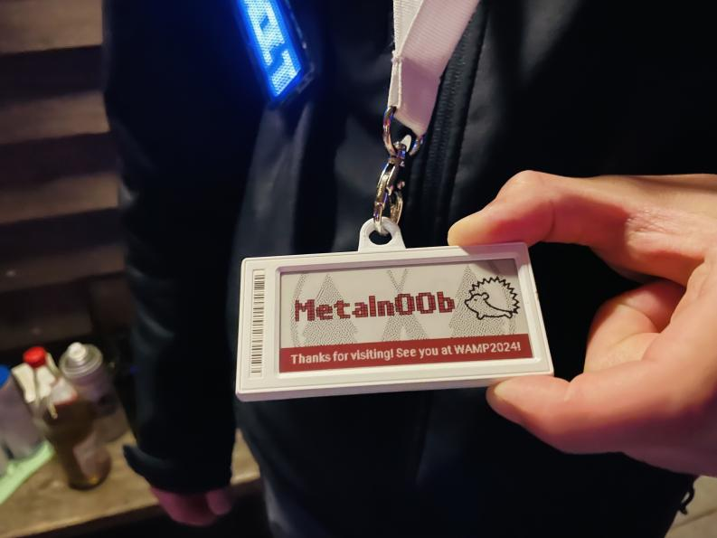
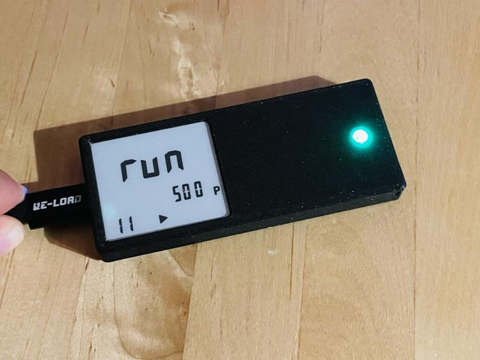

# WAMP2023 Badge Repo

This repo contains all stuff from the [WAMP2023](https://westwood.camp) Badge.

You find here the:

- [Lanyard Holder for the 2.9" Epaper Display](./Lanyard%20Holder)
- [The special Tag Firmware for the event](./OpenEPaperLink-EventTagFirmware)
- [The python backend service](./OpenEPaperLink-PyStation)
- [The the AP firmware](./OpenEPaperLink-ESP-AP)
- [A presentation from the event with some impressions](./WAMP2023%20-%20Badge%20FAQ.pdf)
